# 🚪 Envoy Gateway (Gateway API) Implementation

This guide provides a step-by-step implementation of **Envoy Gateway**.
It is designed to run **alongside** your existing Traefik Ingress.

## 📂 Structure
*   `01-system-setup/`: **Run Once.** Installs the controller and the main Gateway (LoadBalancer).
*   `02-service-templates/`: **Run Per Service.** Templates for routing traffic.
## 🌊 Traffic Flow Architecture

```mermaid
graph TD
    user((👤 User))
    lb{{"⚖️ MetalLB (L2)"}}
    gateway["🚪 Envoy Gateway (IP: .102)"]
    route["⚡ HTTPRoute"]
    svc["🧩 Kubernetes Service"]
    pod["📦 App Pods"]

    user -- "http://demo.172.16.16.102.sslip.io" --> lb
    lb -- "172.16.16.102" --> gateway
    gateway -- "Routing Rules" --> route
    route -- "backendRef" --> svc
    svc --> pod

    style user fill:#fff,stroke:#333
    style lb fill:#fff3e0,stroke:#ff6f00
    style gateway fill:#e1f5fe,stroke:#01579b
    style route fill:#e8f5e9,stroke:#2e7d32
    style svc fill:#f3e5f5,stroke:#7b1fa2
    style pod fill:#ffebee,stroke:#c62828
```



---

## 1️⃣ System Setup (One-Time)

### Step 1: Install Controller
Run the installation script to deploy Envoy Gateway System.

```bash
chmod +x 01-system-setup/00-install.sh
./01-system-setup/00-install.sh
```

### Step 2: Create the Gateway (LoadBalancer)
This creates the "Digital Door" that listens for traffic. MetalLB will assign it a **NEW IP** (e.g., `172.16.16.102`).

```bash
kubectl apply -f 01-system-setup/01-gateway.yaml
```

### Step 3: Verify the IP
Check the IP assigned to your new Gateway:

```bash
kubectl get gateways -n default
# Look for the ADDRESS column (e.g., 172.16.16.102)
```

---

## 2️⃣ Per-Service Setup (Repeatable)

### Step 4: Create a Route
For every new application, create an `HTTPRoute`.

1.  Copy the template:
    ```bash
    cp 02-service-templates/http-route.yaml my-new-app-route.yaml
    ```
2.  Edit `my-new-app-route.yaml`:
    *   **hostnames**: Change to your domain (e.g., `api.172.16.16.102.sslip.io`)
    *   **backendRefs**: Change to your Service Name and Port.
3.  Apply it:
    ```bash
    kubectl apply -f my-new-app-route.yaml
    ```

---

## ❓ FAQ

**Q: Will this conflict with Traefik?**
A: **No.** They use separate physical IPs.
*   Traefik: `172.16.16.101`
*   Envoy: `172.16.16.102` (example)

**Q: Which one handles port 80?**
A: **Both.**
*   Traffic to `.101:80` -> Traefik
*   Traffic to `.102:80` -> Envoy
