# 🛡️ Envoy Gateway (Kubernetes Gateway API)

This module implements the **Kubernetes Gateway API** using **Envoy Gateway v1.6**.

> [!TIP]
> Gateway API is the modern, extensible successor to the Ingress API. It provides more expressive routing, better role-based access, and is vendor-neutral.

---

## 📂 Directory Structure

| Folder | Purpose |
| :--- | :--- |
| `01-system-setup/` | **One-time setup:** GatewayClass, Gateway, and controller installation. |
| `02-service-templates/` | **Reusable templates:** HTTPRoute blueprints for new services. |
| `03-example-app/` | **Working demo:** Complete Deployment + HTTPRoute example. |

---

## 🌊 Architecture & Traffic Flow

```mermaid
%%{init: {'theme': 'base', 'themeVariables': { 'primaryColor': '#e3f2fd', 'lineColor': '#1976d2'}}}%%

graph LR
    subgraph EXTERNAL ["🌍 External"]
        user(("User"))
        dns["demo.172.16.16.102.sslip.io"]
    end

    subgraph METALLB ["⚖️ MetalLB"]
        lb["IP: 172.16.16.102"]
    end

    subgraph ENVOY ["🛡️ Envoy Gateway"]
        gateway["Gateway<br/>(my-envoy-gateway)"]
        route["HTTPRoute<br/>(envoy-demo-route)"]
    end

    subgraph K8S ["☸️ Kubernetes"]
        svc["Service<br/>(envoy-demo-svc)"]
        pod1["Pod 1"]
        pod2["Pod 2"]
    end

    user --> dns --> lb --> gateway --> route --> svc
    svc --> pod1
    svc --> pod2

    style EXTERNAL fill:#fff,stroke:#333
    style METALLB fill:#fff3e0,stroke:#e65100
    style ENVOY fill:#e3f2fd,stroke:#1976d2,stroke-width:2px
    style K8S fill:#f3e5f5,stroke:#7b1fa2
    style gateway fill:#bbdefb,stroke:#1565c0
    style route fill:#c8e6c9,stroke:#388e3c
```



---

## 🚀 Quick Start

### Step 1: Install Controller (One-Time)

```bash
# Install Envoy Gateway via Helm
helm install eg oci://docker.io/envoyproxy/gateway-helm --version v1.6.1 \
  -n envoy-gateway-system \
  --create-namespace

# Apply GatewayClass
kubectl apply -f 01-system-setup/00-gatewayclass.yaml

# Create the main Gateway (Gets IP from MetalLB)
kubectl apply -f 01-system-setup/01-gateway.yaml

# Verify
kubectl get gateways -n default
# Expected: ADDRESS = 172.16.16.102, PROGRAMMED = True
```

### Step 2: Deploy Example App

```bash
kubectl apply -f 03-example-app/
```

### Step 3: Test

```bash
curl http://demo.172.16.16.102.sslip.io
# You should see the podinfo response!
```

---

## 📝 Adding New Services

1. Copy the template:
   ```bash
   cp 02-service-templates/http-route.yaml my-new-route.yaml
   ```

2. Edit `my-new-route.yaml`:
   - Change `hostnames` to your domain.
   - Change `backendRefs` to point to your Service.

3. Apply:
   ```bash
   kubectl apply -f my-new-route.yaml
   ```

---

## 🆚 Gateway API vs Ingress API

| Feature | Ingress API | Gateway API |
| :--- | :--- | :--- |
| **Maturity** | Stable (Legacy) | Stable (Modern) |
| **Expressiveness** | Limited | Rich (Headers, Weights, etc.) |
| **Multi-tenancy** | Poor | Excellent (Role separation) |
| **Vendor Lock-in** | Varies | Minimal (Standardized) |
| **Our Implementation** | Traefik (`.101`) | Envoy (`.102`) |

---

## 📚 Resources

- [Gateway API Docs](https://gateway-api.sigs.k8s.io/)
- [Envoy Gateway Docs](https://gateway.envoyproxy.io/)
