# 🛡️ Envoy Gateway (Kubernetes Gateway API)

This module implements the **Kubernetes Gateway API** using **Envoy Gateway v1.6**.

> [!TIP]
> Gateway API is the modern, extensible successor to the Ingress API. It provides more expressive routing, better role-based access, and is vendor-neutral.

---

## 📂 Directory Structure

| Folder | Purpose |
| :--- | :--- |
| `01-system-setup/` | **One-time setup:** GatewayClass, Gateway, and controller installation. |
| `02-service-templates/` | **Reusable templates:** HTTPRoute blueprints for new services. |
| `03-example-app/` | **Working demo:** Complete Deployment + HTTPRoute example. |

---

## 🌊 Traffic Flow Architecture

```mermaid
%%{init: {'theme': 'base', 'themeVariables': { 'primaryColor': '#ffffff', 'lineColor': '#1976d2', 'fontFamily': 'Inter, sans-serif'}}}%%

graph LR
    subgraph EXTERNAL ["🌐 Internet"]
        user(("👤 User"))
        dns["DNS: demo...sslip.io"]
    end

    subgraph NETWORK ["⚖️ L2 Network"]
        lb["<b>MetalLB Speaker</b><br/>IP: 172.16.16.102"]
    end

    subgraph ENVOY ["🛡️ Envoy Gateway (L7)"]
        gateway["🚪 <b>Gateway</b><br/>(Listener: 80/443)"]
        route["⚡ <b>HTTPRoute</b><br/>(Rules Engine)"]
    end

    subgraph APPS ["☸️ Data Plane"]
        svc["🧩 <b>ClusterIP Svc</b><br/>(Backend)"]
        pod["📦 <b>App Pods</b><br/>(podinfo)"]
    end

    %% Flow
    user -- "HTTPS" --> dns
    dns -- "ARP/IP" --> lb
    lb ==> gateway
    gateway -- "Path Matching" --> route
    route -- "LoadBalance" --> svc
    svc --> pod

    %% Styling
    style ENVOY fill:#e3f2fd,stroke:#1565c0,stroke-width:2px
    style NETWORK fill:#fff3e0,stroke:#e65100
    style APPS fill:#f3e5f5,stroke:#7b1fa2
    style gateway fill:#bbdefb,stroke:#1565c0
    style route fill:#c8e6c9,stroke:#388e3c
```



---

## 🏗️ Shared Gateway Architecture

We utilize a **Shared Gateway** pattern to maximize efficiency and mimic a production cloud environment:

1.  **Single Gateway (Infrastructure):**
    *   One Gateway resource (`my-envoy-gateway`) in the `default` namespace.
    *   Acquires a **Single LoadBalancer IP** (`172.16.16.102`) from MetalLB.
    *   Configured with `allowedRoutes: namespaces: from: All` to accept routes from any namespace.

2.  **Distributed Routes (Application):**
    *   Each application uses its own `HTTPRoute` in its own Namespace.
    *   Application teams manage their routing logic (paths, headers) independently.
    *   All routes merge into the single Listener on the Shared Gateway.

**Benefits:**
*   ✅ **Cost Efficient:** Uses only 1 Public IP for N services.
*   ✅ **Centralized Security:** TLS termination and Policies managed at the Gateway level.
*   ✅ **Developer Autonomy:** app teams own their `HTTPRoute` config.

---

## 🚀 Quick Start

### Step 1: Install Controller (One-Time)

```bash
# Install Envoy Gateway via Helm
helm install eg oci://docker.io/envoyproxy/gateway-helm --version v1.6.1 \
  -n envoy-gateway-system \
  --create-namespace

# Apply GatewayClass
kubectl apply -f 01-system-setup/00-gatewayclass.yaml

# Create the main Gateway (Gets IP from MetalLB)
kubectl apply -f 01-system-setup/01-gateway.yaml

# Verify
kubectl get gateways -n default
# Expected: ADDRESS = 172.16.16.102, PROGRAMMED = True
```

### Step 2: Deploy Example App

```bash
kubectl apply -f 03-example-app/
```

### Step 3: Test

```bash
curl http://demo.172.16.16.102.sslip.io
# You should see the podinfo response!
```

---

## 📝 Adding New Services

1. Copy the template:
   ```bash
   cp 02-service-templates/http-route.yaml my-new-route.yaml
   ```

2. Edit `my-new-route.yaml`:
   - Change `hostnames` to your domain.
   - Change `backendRefs` to point to your Service.

3. Apply:
   ```bash
   kubectl apply -f my-new-route.yaml
   ```

---

## 🆚 Gateway API vs Ingress API

| Feature | Ingress API | Gateway API |
| :--- | :--- | :--- |
| **Maturity** | Stable (Legacy) | Stable (Modern) |
| **Expressiveness** | Limited | Rich (Headers, Weights, etc.) |
| **Multi-tenancy** | Poor | Excellent (Role separation) |
| **Vendor Lock-in** | Varies | Minimal (Standardized) |
| **Our Implementation** | Traefik (`.101`) | Envoy (`.102`) |

---

## 📚 Resources

- [Gateway API Docs](https://gateway-api.sigs.k8s.io/)
- [Envoy Gateway Docs](https://gateway.envoyproxy.io/)
