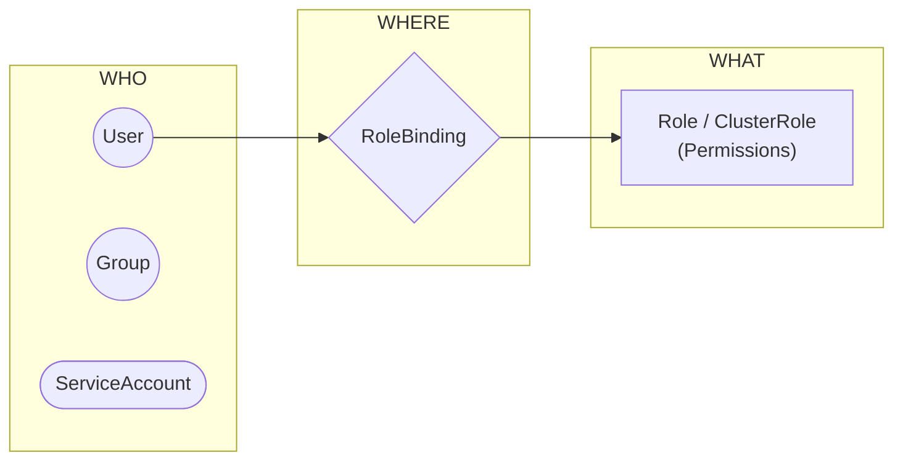

# Kubernetes RBAC: A Practical Guide

This guide explains **Role-Based Access Control (RBAC)** in Kubernetes, simplifying how permissions (Authorization) work.

## 1. The Core Concept: The "Three Pillars"

RBAC in Kubernetes is always about connecting **Three Things**:

1.  **WHO** (Subject): A User, a Group, or a ServiceAccount (Bot).
2.  **WHAT** (Role): A set of permissions (Rules) saying *what actions* are allowed (e.g., "Can list Pods").
3.  **WHERE** (Binding): The glue that connects the **WHO** to the **WHAT**.



---

## 2. Role vs. ClusterRole

The main difference is the **Scope** (The "Playground").

| Feature | Role | ClusterRole |
| :--- | :--- | :--- |
| **Scope** | **Namespace Specific** (e.g., only inside `dev`). | **Cluster Wide** (The whole cluster) OR Reusable. |
| **Resources** | Namespaced resources (Pods, PVCs, Services). | Cluster resources (Nodes, PVs) + Namespaced ones. |
| **Typical Use** | Allowing a developer to work on their project. | Admins, Monitoring Agents, global controllers. |

> **Key Takeaway:** You can use a `ClusterRole` (the definition) with a `RoleBinding` (the connection). This lets you define a common permission (like "View Only") once, and reuse it in many namespaces.

---

## 3. Practical Use Cases

### Use Case A: The "View-Only" Auditor
**Scenario:** You have a security auditor who needs to **see** everything in the `production` namespace but **touch nothing**.

1.  **Role (The Definition):**
    ```yaml
    apiVersion: rbac.authorization.k8s.io/v1
    kind: Role
    metadata:
      namespace: production
      name: auditor-read-only
    rules:
      - apiGroups: ["*"]
        resources: ["*"]
        verbs: ["get", "list", "watch"] # No Create, Update, Delete
    ```

2.  **RoleBinding (The Connection):**
    ```yaml
    apiVersion: rbac.authorization.k8s.io/v1
    kind: RoleBinding
    metadata:
      namespace: production
      name: assign-auditor
    subjects:
      - kind: User
        name: sarah-audit
        apiGroup: rbac.authorization.k8s.io
    roleRef:
      kind: Role
      name: auditor-read-only
      apiGroup: rbac.authorization.k8s.io
    ```

### Use Case B: The CI/CD Bot (Deployer)
**Scenario:** GitHub Actions needs to deploy apps to `cloudycode-uat` but shouldn't be able to delete the database volume.

1.  **Role:**
    ```yaml
    apiVersion: rbac.authorization.k8s.io/v1
    kind: Role
    metadata:
      namespace: cloudycode-uat
      name: ci-deployer
    rules:
      - apiGroups: ["apps", ""] # Deployments (apps), Pods/Services (core)
        resources: ["deployments", "services", "pods"]
        verbs: ["create", "update", "patch", "delete"]
    ```
    *(Notice we did NOT include `persistentvolumeclaims`)*

### Use Case C: The "Super Admin" (Your Case)
**Scenario:** You (`ahmedbelal`) need full control over a specific namespace `cloudycode-uat`.

1.  **Role:**
    ```yaml
    apiVersion: rbac.authorization.k8s.io/v1
    kind: Role
    metadata:
      namespace: cloudycode-uat
      name: local-admin
    rules:
      - apiGroups: ["*"] # Everything
        resources: ["*"] # Everything
        verbs: ["*"]     # Everything
    ```

2.  **RoleBinding:** Connects you to this role inside `cloudycode-uat`.

---

## 4. How Permission Override Works (It Doesn't)

Permissions in Kubernetes are **Additive (Union)**.
*   If **Binding A** gives you "View Pods".
*   And **Binding B** gives you "Delete Services".
*   **Result:** You can "View Pods" AND "Delete Services".

Nothing "overrides" or "blocks" anything else. If *any* active binding says "Yes", then you are allowed.

---

## 5. Verification: Proving It Works

You can verify your permissions using the `kubectl auth can-i` command. This simulates an action to see if it's allowed.

**1. Check Default Namespace (Should fail):**
You don't have permissions in the `default` namespace.
```bash
kubectl auth can-i list pods --as ahmedbelal
# Output: no
```

**2. Check Target Namespace (Should succeed):**
You HAVE permissions in `cloudycode-uat`.
```bash
kubectl auth can-i list pods --as ahmedbelal -n cloudycode-uat
# Output: yes
```
