# 🦅 Kubernetes HA on Talos Linux

Welcome to the **Ultimate Kubernetes High Availability Cluster** lab!
This project demonstrates a production-grade, fully automated Kubernetes cluster built on **Talos Linux** (IP-OS), designed for resilience, security, and modern GitOps practices.

---

## 🌟 Features & Capabilities

| Feature | Description | Status |
| :--- | :--- | :--- |
| **👑 HA Control Plane** | 3 Nodes with a Floating VIP (`100`) for zero-downtime API access. | ✅ Active |
| **🔒 Immutable OS** | **Talos Linux**: Read-only file system, API-driven, and highly secure. | ✅ Active |
| **⚖️ Load Balancing** | **MetalLB** provides physical IPs (Layer 2) to Services. | ✅ Active |
| **🚦 Ingress Controller** | **Traefik** routing HTTP/HTTPS traffic with automatic IP assignment. | ✅ Active |
| **🪄 Magic DNS** | **sslip.io** mapping (`*.101.sslip.io`) for instant domain resolution. | ✅ Active |
| **🔐 TLS/SSL** | **Cert-Manager** issuing Self-Signed certificates for secure HTTPS. | ✅ Active |
| **📦 Distributed Storage**| **Longhorn** providing replicated persistent volumes (Block Storage). | ✅ Active |
| **📊 Observability** | **Metrics Server** for real-time resource tracking and autoscaling. | ✅ Active |

---

## 🛠️ Technology Stack

| Component | Software | Version | Purpose |
| :--- | :--- | :--- | :--- |
| **OS** | [Talos Linux](https://www.talos.dev/) | `v1.9.1` | The foundation. Secure, minimal K8s OS. |
| **Kernel** | Linux | `6.x` | Optimized for container workloads. |
| **Container Runtime** | Containerd | `Latest` | Industry standard runtime. |
| **CNI** | Flannel | `Latest` | Simple, robust overlay networking. |
| **Load Balancer** | MetalLB | `v0.15.3` | Bare-metal LoadBalancer implementation. |
| **Ingress** | Traefik | `v3.x` | Edge router & service proxy. |
| **Storage** | Longhorn | `Latest` | Cloud-native distributed block storage. |
| **Cert-Manager** | Cert-Manager | `v1.16.x` | X.509 certificate management. |

---

## 📂 Project Structure & Guides

Start your journey here steps 1 through 6:

| # | Directory | Module Description |
| :--- | :--- | :--- |
| **01** | **[01-talos-bootstrap/](./01-talos-bootstrap/)** | **Bootstrap:** OS Install, Network Config, & Etcd Cluster Init. |
| **02** | **[02-metallb/](./02-metallb/)** | **Networking:** MetalLB setup for Service IP pools. |
| **03** | **[03-metrics-server/](./03-metrics-server/)** | **Monitoring:** Enable `kubectl top` and HPA. |
| **04** | **[04-traefik-ingress/](./04-traefik-ingress/)** | **Ingress:** Traefik Controller & Magic DNS. |
| **05** | **[05-cert-manager/](./05-cert-manager/)** | **Security:** HTTPS & Self-Signed Certificates. |

| **06** | **[06-storage-longhorn/](./06-storage-longhorn/)** | **Storage:** Persistent Volumes & Longhorn UI. |
| **07** | **[07-dashboard-headlamp/](./07-dashboard-headlamp/)** | **Dashboard:** Headlamp UI & Admin Access. |

---

## 🔧 High Availability
| Doc | Description |
| :--- | :--- |
| **[HA-VERIFICATION.md](./HA-VERIFICATION.md)** | Guide for verifying cluster health during node failures. |

---

## 🚀 Access & Usage

### 🔑 Cluster Access
```bash
# Point kubectl to the local config
export KUBECONFIG=$(pwd)/kubeconfig

# Check Nodes
kubectl get nodes -o wide
```

### 🖥️ Dashboards & endpoints
| Service | URL | Protocol |
| :--- | :--- | :--- |
| **Whoami App** | `http://whoami.172.16.16.101.sslip.io` | HTTP |
| **Whoami (Secure)**| `https://whoami.172.16.16.101.sslip.io` | HTTPS 🔒 |
| **Longhorn UI** | `http://longhorn.172.16.16.101.sslip.io` | HTTP |
| **Headlamp Dashboard** | `https://headlamp.172.16.16.101.sslip.io` | HTTPS 🔒 |

---

## 🗺️ High-Level Architecture

```mermaid
graph TD
    %% Users and DNS
    user(("🌍 Internet / Users"))

    subgraph DNS ["🌐 DNS Resolution (sslip.io)"]
        direction LR
        dns_legacy["*.101.sslip.io"]
        dns_modern["*.102.sslip.io"]
    end

    %% Network Entry
    subgraph Cluster ["🦅 Talos Kubernetes Cluster"]
        direction TB

        %% Control Plane
        subgraph CP ["🧠 Control Plane (VIP: .100)"]
            api["API Server"]
            etcd[("Etcd")]
        end

        %% Layer 2 Load Balancing
        subgraph L2 ["⚖️ Layer 2 MetalLB"]
            direction TB
            ip_traefik["IP: 172.16.16.101"]
            ip_envoy["IP: 172.16.16.102"]
        end

        %% Layer 7 Routing (The Core Request)
        subgraph L7 ["🚦 Traffic Controllers"]
            direction LR

            subgraph Path1 ["📉 Legacy Path (Ingress API)"]
                style Path1 fill:#f5f5f5,stroke:#9e9e9e,stroke-dasharray: 5 5
                traefik["🏁 Traefik Controller<br/>(Ingress Class: traefik)"]
            end

            subgraph Path2 ["🚀 Modern Path (Gateway API)"]
                style Path2 fill:#e3f2fd,stroke:#2196f3,stroke-width:2px
                envoy["🛡️ Envoy Gateway<br/>(Gateway Class: eg)"]
            end
        end

        %% Workloads
        subgraph Workloads ["📦 Application Workloads"]
            app1["Old App (Ingress)"]
            app2["New App (HTTPRoute)"]
        end
    end

    %% Connections
    user ==> DNS
    dns_legacy -.-> ip_traefik
    dns_modern == "Modern Traffic" ==> ip_envoy

    ip_traefik --> traefik
    ip_envoy ==> envoy

    traefik --> app1
    envoy ==> app2

    %% Styling
    style Cluster fill:#fafafa,stroke:#333,stroke-width:2px
    style CP fill:#e0f7fa,stroke:#006064
    style L2 fill:#fff3e0,stroke:#e65100
    style L7 fill:#fff,stroke:#fff
    style traefik fill:#eee,stroke:#333
    style envoy fill:#2979ff,stroke:#0d47a1,color:#fff
    style Workloads fill:#f3e5f5,stroke:#7b1fa2
```



## 🌐 Network & IP Plan

| IP Address | Hostname | Role |
| :--- | :--- | :--- |
| `172.16.16.147` | `cp01` | Control Plane 01 |
| `172.16.16.148` | `cp02` | Control Plane 02 |
| `172.16.16.149` | `cp03` | Control Plane 03 |
| `172.16.16.150` | `wk01` | Worker Node 01 |
| `172.16.16.151` | `wk02` | Worker Node 02 |
| `172.16.16.152` | `wk03` | Worker Node 03 |
| **`172.16.16.100`** | **VIP** | **Control Plane VIP** |
| **`172.16.16.101`** | **Traefik** | **Standard Ingress** |
| **`172.16.16.102`** | **Envoy** | **Gateway API** |
| `172.16.16.101-120` | MetalLB | Service IP Pool |