# 🦅 Kubernetes HA on Talos Linux

Welcome to the **Ultimate Kubernetes High Availability Cluster** lab!
This project demonstrates a production-grade, fully automated Kubernetes cluster built on **Talos Linux**, designed for resilience, security, and modern GitOps practices.

---

## 🗺️ High-Level Architecture

```mermaid
%%{init: {'theme': 'base', 'themeVariables': { 'primaryColor': '#e3f2fd', 'lineColor': '#424242', 'fontFamily': 'Inter, sans-serif'}}}%%

graph LR
    %% 📡 External Access Points
    subgraph Access ["🌍 Access Paths"]
        admin(("👨‍💻 Admin<br/>(kubectl/talosctl)"))
        users(("🌐 Users<br/>(HTTP/HTTPS)"))
    end

    %% 🔐 Entry Points (Network Layer)
    subgraph Entry ["🔐 Entry Points"]
        vip["🔴 <b>VIP: 172.16.16.100</b><br/>(API Server Access)"]
        lb_pool["⚖️ <b>MetalLB Pool</b><br/>(Service IP Pool)"]
    end

    %% 🧠 Control Plane & Core stack
    subgraph CLUSTER ["🦅 Talos HA Cluster"]
        direction LR

        subgraph CP ["🧠 Control Plane"]
            direction TB
            cp_nodes["3x Nodes<br/>(Active/Passive)"]
            api["K8s API Server"]
            etcd[("Stacked Etcd")]
        end

        subgraph INGRESS ["🚦 Traffic Routing"]
            direction TB
            traefik["🏁 <b>Traefik v3</b><br/>(.101 - Ingress API)"]
            envoy["🛡️ <b>Envoy v1.6</b><br/>(.102 - Gateway API)"]
        end

        subgraph DATA ["💪 Data Plane"]
            direction TB
            wk_nodes["3x Worker Nodes<br/>(wk01-03)"]
            storage["💾 Longhorn<br/>(Block Storage)"]
            cni["🔗 Flannel CNI"]
        end
    end

    %% 🔗 Connections (The Logic)
    admin -- "Manage" --> vip
    vip --> api
    api -.-> cp_nodes
    cp_nodes --- etcd

    users -- "Apps" --> lb_pool
    lb_pool -- ".101" --> traefik
    lb_pool -- ".102" --> envoy

    traefik ==> wk_nodes
    envoy ==> wk_nodes
    wk_nodes --- storage
    wk_nodes --- cni

    %% 🎨 Styling
    style Access fill:none,stroke:none
    style Entry fill:#f5f5f5,stroke:#333,stroke-width:2px,stroke-dasharray: 5 5
    style CLUSTER fill:#fafafa,stroke:#333,stroke-width:3px
    style CP fill:#e0f7fa,stroke:#006064
    style INGRESS fill:#e3f2fd,stroke:#1565c0
    style DATA fill:#f3e5f5,stroke:#7b1fa2
    style vip fill:#ffcdd2,stroke:#c62828
    style lb_pool fill:#fff3e0,stroke:#e65100
```



---

## 🌐 Network & IP Plan

| IP Address | Hostname | Role |
| :--- | :--- | :--- |
| `172.16.16.147` | `cp01` | Control Plane 01 (Leader) |
| `172.16.16.148` | `cp02` | Control Plane 02 |
| `172.16.16.149` | `cp03` | Control Plane 03 |
| `172.16.16.150` | `wk01` | Worker Node 01 |
| `172.16.16.151` | `wk02` | Worker Node 02 |
| `172.16.16.152` | `wk03` | Worker Node 03 |
| **`172.16.16.100`** | **VIP** | **Control Plane VIP** |
| **`172.16.16.101`** | **Traefik** | **Ingress (Legacy)** |
| **`172.16.16.102`** | **Envoy** | **Gateway API (Modern)** |
| `172.16.16.101-120` | MetalLB | Service IP Pool |

---

## 🌟 Features & Capabilities

| Feature | Description | Status |
| :--- | :--- | :--- |
| **👑 HA Control Plane** | 3-node stacked etcd with floating VIP (`.100`) | 🟢 **Ready** |
| **🔒 Immutable OS** | Talos Linux: API-Only, No SSH, Read-Only FS | 🛡️ **Hardened** |
| **⚖️ L2 Load Balancer** | MetalLB providing physical IP assignment to LB types | ⚡ **Active** |
| **🚦 Traffic Switching** | Traefik (Legacy) & Envoy (Modern) co-existence | 🛤️ **Configured** |
| **🪄 Magic DNS** | Full `sslip.io` integration for automated subdomains | 🌐 **Enabled** |
| **🔐 SSL/TLS Automation**| Cert-Manager issuing per-service certificates | 🛡️ **Verified** |
| **📦 Distributed Storage**| Longhorn replicated PVs across all worker nodes | 💿 **Storage OK** |
| **📊 Dashboarding** | Headlamp & Longhorn UI for management | 🖥️ **Live** |

---

## 🛠️ Technology Stack

| Component | Software | Version | Purpose |
| :--- | :--- | :--- | :--- |
| **OS** | [Talos Linux](https://www.talos.dev/) | `v1.9.1` | Security-first, API-managed OS |
| **Orchestrator** | Kubernetes | `v1.35.0` | Container orchestration engine |
| **CNI** | Flannel | `v0.26.x` | Pod networking & VXLAN overlay |
| **Load Balancer** | MetalLB | `v0.15.3` | Layer 2 bare-metal LoadBalancer |
| **Ingress** | Traefik | `v3.3.x` | Standard Ingress routing (`.101`) |
| **Gateway API** | Envoy Gateway | `v1.6.1` | Modern Gateway API routing (`.102`) |
| **Storage** | Longhorn | `v1.7.x` | Distributed block storage for PVs |
| **Cert-Manager** | Cert-Manager | `v1.16.x` | Certificate lifecycle management |
| **Metrics** | Metrics Server | `v0.7.x` | Resource tracking (CPU/RAM) |

---

## 📂 Project Structure

| # | Directory | Description |
| :--- | :--- | :--- |
| **01** | [01-talos-bootstrap/](./01-talos-bootstrap/) | OS Install & Etcd Init |
| **02** | [02-metallb/](./02-metallb/) | MetalLB IP Pool |
| **03** | [03-metrics-server/](./03-metrics-server/) | Metrics Server |
| **04** | [04-traefik-ingress/](./04-traefik-ingress/) | Traefik Ingress |
| **05** | [05-cert-manager/](./05-cert-manager/) | TLS Certificates |
| **06** | [06-storage-longhorn/](./06-storage-longhorn/) | Longhorn Storage |
| **07** | [07-dashboard-headlamp/](./07-dashboard-headlamp/) | Headlamp UI |
| **08** | [08-gateway-envoy/](./08-gateway-envoy/) | Envoy Gateway API |

---

## 🚀 Quick Access

### 🔑 Cluster Access
```bash
export KUBECONFIG=$(pwd)/kubeconfig
kubectl get nodes -o wide
```

### 🖥️ Dashboards & Endpoints

| Service | URL | Access Protocol |
| :--- | :--- | :--- |
| **🚀 Envoy Demo** | `http://demo.172.16.16.102.sslip.io` | **Modern Path (.102)** |
| **🚦 Whoami App** | `https://whoami.172.16.16.101.sslip.io` | **Legacy Path (.101)** |
| **🖥️ Headlamp Dashboard**| `https://headlamp.172.16.16.101.sslip.io` | Web UI |
| **💿 Longhorn UI** | `http://longhorn.172.16.16.101.sslip.io` | Web UI |
| **🔧 Metrics Server** | `kubectl top nodes` | CLI Only |

---

## 🔧 HA Verification

| Doc | Description |
| :--- | :--- |
| [HA-VERIFICATION.md](./HA-VERIFICATION.md) | Guide for verifying cluster health during node failures. |